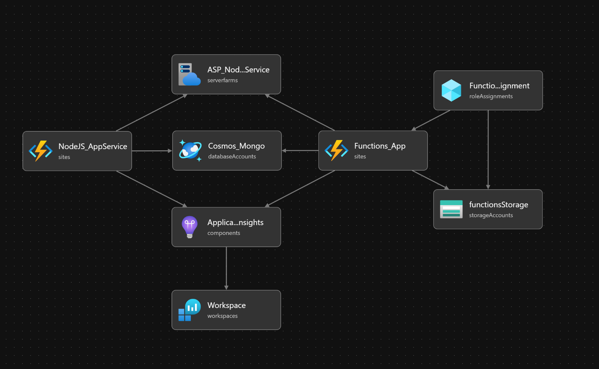

# OsTu-App Infrastruktuuri
Tässä dokumentaatiossa kuvataan, kuinka Saukko-App ympäristö rakennetaan, deployataan ja konfiguroidaan käyttämällä bicep-tiedostoa. Tämä dokumentaatio on tarkoitettu helpottamaan projektin ylläpitoa ja jatkokehitystä.

Kuva Projektin infrastruktuurista on luotu käyttäen bicep visualisointityökalua.

### Sisällysluettelo
* [ApplicationInsights](applicationInsights.md)
* [App Service](appService.md)
* [Functions App](functionsApp.md)
* [CORS](cors.md)
* [Käyttöönotto](infra.md)